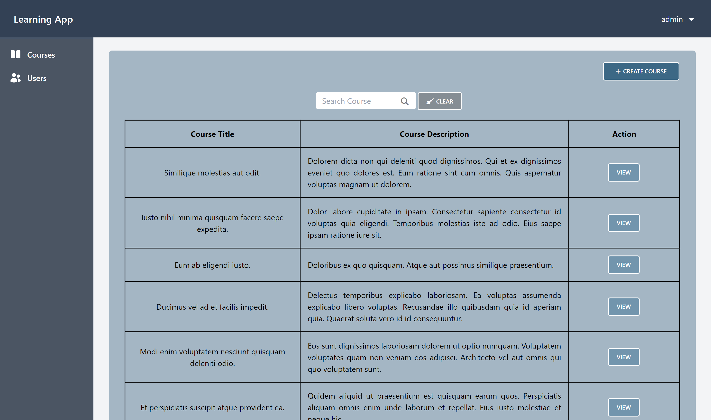
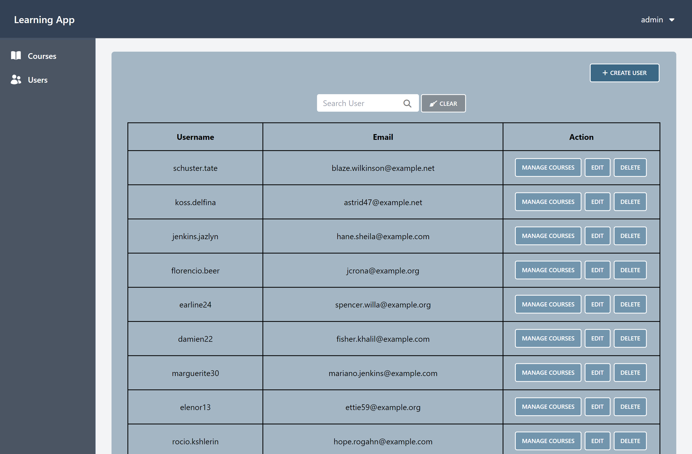
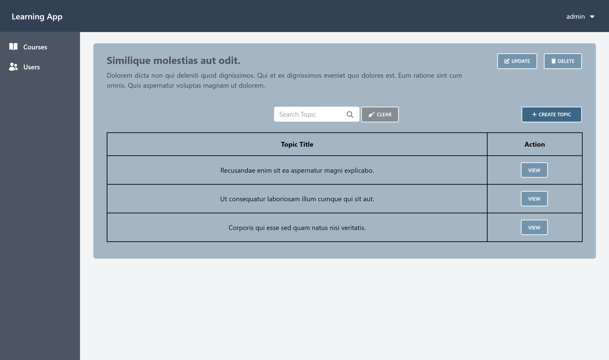
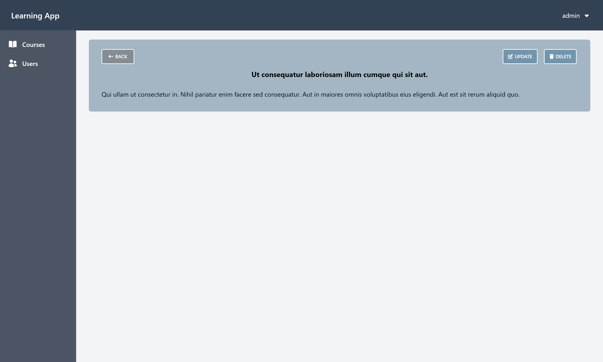
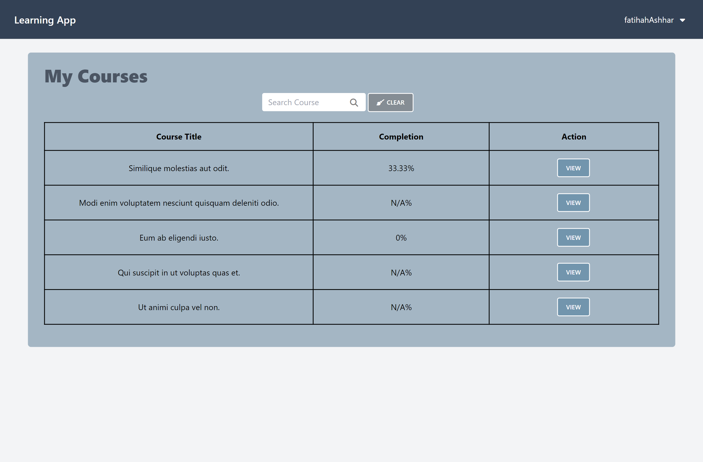
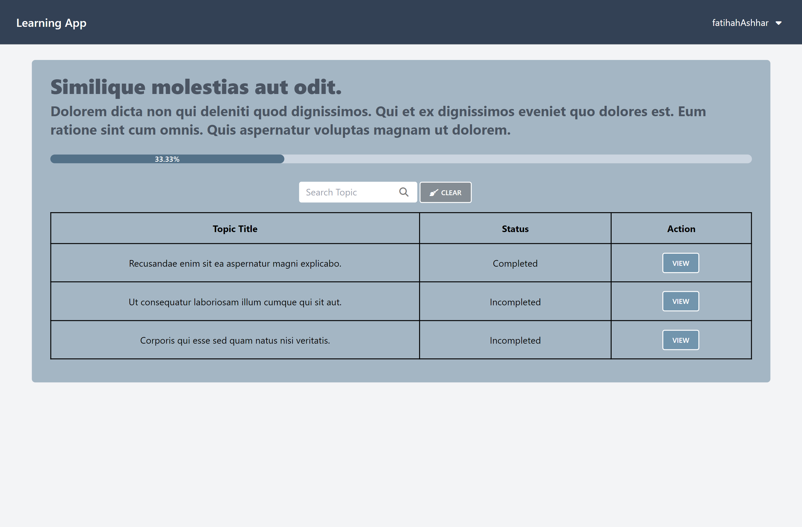
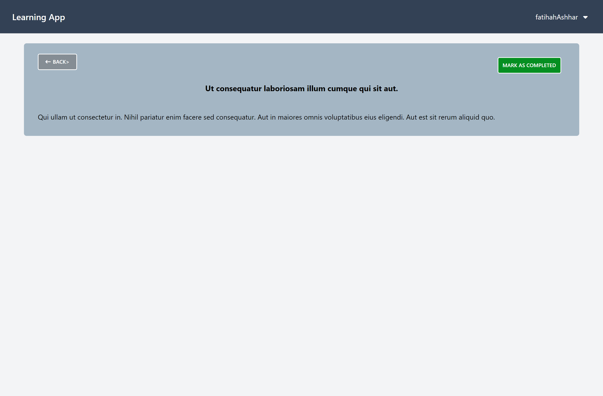

# Learning App

The **Learning App** is a web-based platform designed for managing online courses and tracking student progress. Built with Laravel and Vue.js, this application supports administrators in managing courses and users, while providing students with a user-friendly interface to engage with their courses.

## About the Project

### Language:
- **PHP**

### Technologies:
- **Laravel**: Backend framework for server-side logic.
- **Vue.js**: Front-end framework for dynamic user interfaces.
- **MySQL**: Database for storing user and course data.
- **Bootstrap**: CSS framework for responsive design.

### IDE:
- **VS Code**

### Dependencies:
- **PHP 8.1 or higher**: Required for running the Laravel application.
- **Composer**: Used for managing PHP dependencies.
- **Node.js and npm**: Required for managing frontend dependencies and compiling assets.
- **MySQL**: The database system used for storing application data.
- **Laravel 10.x**: The PHP framework for building the web application.

---

## Features

### Administrator
- **Course Management**: Admins can create, update, and delete courses.
- **User Management**: Admins manage users, including assigning students to courses.
- **Analytics**: Admins view course completion statistics and user progress.

### Students
- **Enroll in Courses**: Students can view and enroll in available courses.
- **Complete Courses**: Students complete assigned courses.
- **Track Progress**: Students track their progress through their dashboard.

---

## Screenshots

### Admin Dashboard - Courses


### Admin - Users


### Admin - Topics


### Admin - Topics (Read)


### Student Dashboard (Courses)


### Student - Course Details 


### Student - Topics Details


---

## Installation Steps

### Steps
1. **Clone the repository:**
   ```bash
   git clone https://github.com/fatihahashhar/learning-app.git

2. **Navigate to the project directory:**
   ```bash
   cd learning-app

3. Install dependencies:
   ```bash
   composer install
   npm install

4. Set up environment variables:
- Copy the .env.example file and rename it to .env
   ```bash
   cp .env.example .env
- Update the .env file with your database credentials and other settings.

5. Generate the application key:
   ```bash
   php artisan key:generate

6. Run migrations:
   ```bash
   php artisan migrate

7. Compile frontend assets:
   ```bash
   npm run dev

8. Serve the application:
   ```bash
   php artisan serve

---

## Usage

### Admin
- Log in as Admin: Use the credentials set up in the database.
- Manage Courses: Create, update, or delete courses.
- Manage Users: Assign courses to users and monitor their progress.

### Students
- Log in as a Student: View assigned courses and start learning.
- Complete Courses: Track your progress and finish courses at your own pace.

---